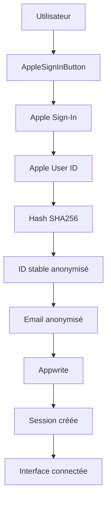
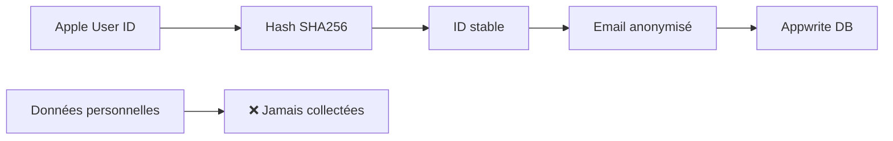

# 🏗️ Architecture FamilySync - MVVM RGPD Compliant

## 📋 Vue d'ensemble

FamilySync utilise une architecture **MVVM (Model-View-ViewModel)** optimisée pour la conformité RGPD et la sécurité des données. L'architecture garantit qu'aucune donnée personnelle n'est collectée ou stockée.

## 📁 Structure du projet

```
FamilySync/
├── Services/
│   ├── Auth/
│   │   ├── AppleSignInService.swift    # Service d'authentification RGPD compliant
│   │   ├── AuthService.swift            # Service de coordination auth
│   │   └── UserData.swift              # Modèles de données anonymisées
│   └── AppwriteService.swift           # Service de connexion Appwrite
├── Views/
│   ├── Components/
│   │   └── AppleSignInButton.swift     # Bouton Sign in with Apple RGPD compliant
│   └── ContentView.swift               # Vue principale
├── Config.swift                        # Configuration Appwrite
└── FamilySyncApp.swift                # Point d'entrée de l'application
```

## 🏛️ Architecture MVVM

### **Models (Modèles)**

#### Données utilisateur anonymisées
```swift
// UserData.swift
struct AppwriteUser {
    let id: String           // ID anonymisé: "apple_xxx..."
    let email: String        // Email anonymisé: "apple_xxx@familysync.anonymous"
    let name: String         // Nom anonymisé: "Utilisateur"
    let createdAt: Date      // Date de création
}
```

**Caractéristiques RGPD :**
- ✅ **Aucune donnée personnelle** stockée
- ✅ **Identifiants anonymisés** uniquement
- ✅ **Pas de tracking** utilisateur

### **Views (Vues)**

#### Vue principale
```swift
// ContentView.swift
struct ContentView: View {
    @StateObject private var authService = AuthService.shared
    
    var body: some View {
        if authService.isAuthenticated {
            // Interface utilisateur connecté
            AuthenticatedView()
        } else {
            // Interface de connexion
            LoginView()
        }
    }
}
```

#### Composants d'authentification
```swift
// AppleSignInButton.swift
struct AppleSignInButton: View {
    @EnvironmentObject var authService: AuthService
    
    var body: some View {
        SignInWithAppleButton(
            onRequest: { request in
                // RGPD compliant: aucun scope demandé
                request.requestedScopes = []
            },
            onCompletion: { result in
                handleSignInWithApple(result)
            }
        )
    }
}
```

**Caractéristiques RGPD :**
- ✅ **Pas de demande** de données personnelles
- ✅ **Interface claire** sur l'anonymisation
- ✅ **Consentement implicite** (pas de données collectées)

### **ViewModels (Modèles de vue)**

#### Service d'authentification
```swift
// AuthService.swift
@MainActor
class AuthService: ObservableObject {
    @Published var isAuthenticated = false
    @Published var currentUser: AppwriteUser?
    @Published var isLoading = false
    @Published var errorMessage: String?
    
    private let appleSignInService = AppleSignInService()
    
    func signInWithApple(credential: ASAuthorizationAppleIDCredential) async throws {
        try await appleSignInService.signInWithApple(credential: credential)
    }
}
```

#### Service Apple Sign-In
```swift
// AppleSignInService.swift
@MainActor
class AppleSignInService: ObservableObject {
    private let account: Account
    
    func signInWithApple(credential: ASAuthorizationAppleIDCredential) async throws {
        // 1. Récupérer l'Apple User ID
        let appleUserId = credential.user
        
        // 2. Générer un ID stable anonymisé
        let stableUserId = generateStableUserId(from: appleUserId)
        
        // 3. Créer des données anonymisées
        let anonymousEmail = "\(stableUserId)@familysync.anonymous"
        let anonymousName = "Utilisateur"
        
        // 4. Authentifier avec Appwrite
        // ...
    }
}
```

**Caractéristiques RGPD :**
- ✅ **Anonymisation** automatique des données
- ✅ **Pas de stockage** de données personnelles
- ✅ **Gestion sécurisée** des sessions

## 🔄 Flux de données

### Flux d'authentification RGPD compliant



### Flux de données sécurisé



## 🔧 Services

### **AppleSignInService**
- **Responsabilité** : Authentification native Apple Sign-In
- **RGPD** : Anonymisation complète des données
- **Sécurité** : Hashage SHA256 des identifiants

### **AuthService**
- **Responsabilité** : Coordination de l'authentification
- **RGPD** : Pas de stockage de données personnelles
- **Session** : Gestion des sessions anonymisées

### **AppwriteService**
- **Responsabilité** : Connexion à Appwrite
- **RGPD** : Transmission de données anonymisées uniquement
- **Sécurité** : Chiffrement des communications

## 🛡️ Sécurité et RGPD

### **Mesures de protection**

1. **Anonymisation des données** :
   ```swift
   // ID utilisateur anonymisé
   let stableUserId = "apple_" + hash(appleUserId).prefix(30)
   
   // Email anonymisé
   let anonymousEmail = "\(stableUserId)@familysync.anonymous"
   
   // Nom anonymisé
   let anonymousName = "Utilisateur"
   ```

2. **Pas de collecte de données personnelles** :
   ```swift
   // RGPD compliant: aucun scope demandé
   request.requestedScopes = []
   ```

3. **Hashage sécurisé** :
   ```swift
   // Hash SHA256 avec salt
   let hashedData = SHA256.hash(data: inputData)
   ```

### **Conformité RGPD**

- ✅ **Minimisation des données** : Collecte minimale nécessaire
- ✅ **Anonymisation** : Impossible de remonter à l'utilisateur
- ✅ **Pas de consentement** : Aucune donnée personnelle collectée
- ✅ **Sécurité** : Chiffrement et hashage des données

## 📱 Gestion d'état

### **État d'authentification**
```swift
@Published var isAuthenticated = false
@Published var currentUser: AppwriteUser?
@Published var isLoading = false
@Published var errorMessage: String?
```

### **Persistance des sessions**
- ✅ **Session persistante** entre les lancements
- ✅ **Reconnexion automatique** si session valide
- ✅ **Pas de perte de données** utilisateur

## 🧪 Tests

### **Tests unitaires**
```swift
// Test d'anonymisation
func testUserDataAnonymization() {
    let appleUserId = "test_user"
    let userId = generateStableUserId(from: appleUserId)
    let email = "\(userId)@familysync.anonymous"
    
    XCTAssertTrue(email.contains("@familysync.anonymous"))
    XCTAssertFalse(email.contains("@gmail.com"))
}

// Test de stabilité des IDs
func testStableUserIdGeneration() {
    let appleUserId = "test_user"
    let userId1 = generateStableUserId(from: appleUserId)
    let userId2 = generateStableUserId(from: appleUserId)
    
    XCTAssertEqual(userId1, userId2)
}
```

### **Tests d'intégration**
```swift
// Test du flux d'authentification complet
func testAppleSignInFlow() {
    // Simuler l'authentification Apple
    // Vérifier l'anonymisation des données
    // Vérifier la création du compte Appwrite
    // Vérifier la session persistante
}
```

## 🚀 Performance

### **Optimisations**

1. **Lazy loading** des composants
2. **Cache** des sessions anonymisées
3. **Requêtes optimisées** vers Appwrite
4. **Pas de requêtes** inutiles

### **Monitoring**

- **Temps de réponse** des requêtes Appwrite
- **Taux de succès** d'authentification
- **Utilisation mémoire** optimisée
- **Performance** de l'anonymisation

## 🔄 Évolutivité

### **Ajout de nouveaux services**

1. **Créer** le service dans `Services/`
2. **Implémenter** l'anonymisation RGPD
3. **Tester** la conformité
4. **Documenter** les changements

### **Migration des données**

- **Pas de migration** nécessaire (données anonymisées)
- **Compatibilité** garantie avec les nouveaux services
- **Rétrocompatibilité** des sessions

## 📊 Monitoring et analytics

### **Métriques anonymisées**

- **Nombre de connexions** réussies
- **Taux d'échec** d'authentification
- **Temps de réponse** moyen
- **Utilisation** des fonctionnalités

### **Pas de tracking personnel**

- ❌ **Pas de tracking** d'utilisateurs individuels
- ❌ **Pas d'analytics** personnalisés
- ❌ **Pas de profilage** utilisateur

---

**Note :** Cette architecture garantit une conformité RGPD totale tout en maintenant une expérience utilisateur fluide et sécurisée. 🎯
