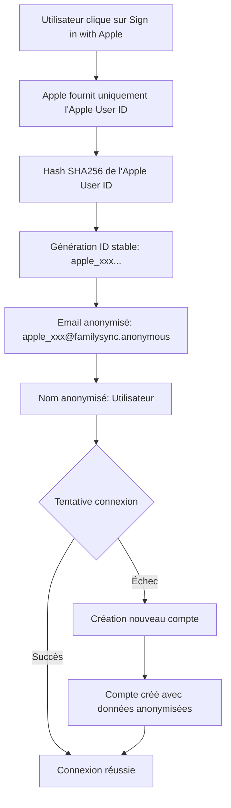

# 🔐 Authentification Apple Sign-In - FamilySync (RGPD Compliant)

## 📋 Vue d'ensemble

L'authentification Apple Sign-In dans FamilySync utilise une approche **native iOS** avec **anonymisation complète des données** pour garantir la conformité RGPD et éviter toute collecte de données personnelles.

## 🏗️ Architecture

### Services impliqués

- **`AppleSignInService`** : Service principal gérant l'authentification native sans collecte de données personnelles
- **`AuthService`** : Service de coordination pour l'authentification
- **`AppleSignInButton`** : Interface utilisateur sans demande de données personnelles

### Flux d'authentification RGPD compliant



## 🔧 Implémentation technique

### 1. Génération de l'ID utilisateur stable

```swift
private func generateStableUserId(from appleUserId: String) -> String {
    // Hash SHA256 de l'Apple User ID
    let inputData = Data(appleUserId.utf8)
    let hashedData = SHA256.hash(data: inputData)
    let hashString = hashedData.compactMap { String(format: "%02x", $0) }.joined()
    
    // Prendre les premiers 30 caractères + préfixe "apple_"
    let shortHash = String(hashString.prefix(30))
    return "apple_\(shortHash)" // Total: 36 caractères max
}
```

**Avantages :**
- ✅ **Déterministe** : Même Apple User ID = même hash = même ID utilisateur
- ✅ **Unique** : SHA256 garantit l'unicité
- ✅ **Conforme Appwrite** : 36 caractères max, caractères autorisés uniquement
- ✅ **Anonymisé** : Impossible de remonter à l'Apple User ID original

### 2. Données enregistrées en base

```swift
// ID utilisateur (stable et anonymisé)
let stableUserId = "apple_a1b2c3d4e5f6g7h8i9j0k1l2m3n4o5"

// Email anonymisé (pas de vraie donnée personnelle)
let anonymousEmail = "apple_a1b2c3d4e5f6g7h8i9j0k1l2m3n4o5@familysync.anonymous"

// Nom anonymisé (pas de vraie donnée personnelle)
let anonymousName = "Utilisateur"

// Mot de passe sécurisé (hashé avec salt)
let password = "a1b2c3d4e5f6g7h8i9j0k1l2m3n4o5p6"
```

### 3. Génération du mot de passe sécurisé

```swift
private func generateSecurePassword(from appleUserId: String) -> String {
    // Hash SHA256 avec salt pour plus de sécurité
    let salt = "FamilySync_RGDP_Salt_2024"
    let inputData = Data("\(appleUserId)\(salt)".utf8)
    let hashedData = SHA256.hash(data: inputData)
    let hashString = hashedData.compactMap { String(format: "%02x", $0) }.joined()
    
    // Prendre les premiers 32 caractères
    return String(hashString.prefix(32))
}
```

## 🛡️ Sécurité et conformité RGPD

### Conformité RGPD

- ✅ **Aucune donnée personnelle** collectée
- ✅ **Anonymisation complète** des identifiants
- ✅ **Impossibilité de tracking** des utilisateurs
- ✅ **Pas de consentement** nécessaire (pas de données personnelles)
- ✅ **Minimisation des données** : collecte minimale nécessaire

### Sécurité technique

- ✅ **Hash SHA256** pour l'ID utilisateur
- ✅ **Salt unique** pour le mot de passe
- ✅ **Caractères autorisés** uniquement (a-z, A-Z, 0-9, _, -)
- ✅ **Limites respectées** (36 chars max pour l'ID)
- ✅ **Pas de stockage** de l'Apple User ID original

### Anti-duplication garantie

- ✅ **Même Apple User ID** = **même compte** à chaque fois
- ✅ **Pas de création multiple** de comptes
- ✅ **Session persistante** entre les connexions

## 📱 Configuration utilisateur

### Bouton Apple Sign-In

```swift
SignInWithAppleButton(
    onRequest: { request in
        // Ne demander AUCUNE donnée personnelle (RGPD compliant)
        request.requestedScopes = []
    },
    onCompletion: { result in
        handleSignInWithApple(result)
    }
)
```

**Scopes demandés :** Aucun (RGPD compliant)
- ❌ Pas de `.email`
- ❌ Pas de `.fullName`
- ✅ Seulement l'Apple User ID (anonymisé)

## 🔄 Gestion des sessions

### Connexion

1. **Récupération** de l'Apple User ID
2. **Génération** de l'ID utilisateur stable
3. **Tentative** de connexion avec l'email anonymisé
4. **Création** du compte si nécessaire
5. **Connexion** réussie

### Déconnexion

```swift
func signOut() async throws {
    _ = try await account.deleteSession(sessionId: "current")
    isAuthenticated = false
    currentUser = nil
}
```

### Persistance

- ✅ **Session persistante** entre les lancements d'app
- ✅ **Reconnexion automatique** si session valide
- ✅ **Pas de perte de données** utilisateur

## 🧪 Tests et debugging

### Logs de debug

```swift
print("🍎 Connexion Apple RGPD compliant (aucune donnée personnelle collectée)...")
print("🔐 Authentification avec Apple User ID anonymisé")
print("✅ Connexion réussie avec utilisateur existant")
print("ℹ️ Utilisateur n'existe pas, création...")
print("✅ Nouveau compte créé et connecté (RGPD compliant)")
```

### Tests unitaires recommandés

```swift
// Test de génération d'ID stable
func testStableUserIdGeneration() {
    let appleUserId = "test_user_id"
    let userId1 = generateStableUserId(from: appleUserId)
    let userId2 = generateStableUserId(from: appleUserId)
    XCTAssertEqual(userId1, userId2) // Même ID pour même Apple User ID
}

// Test d'anonymisation
func testEmailAnonymization() {
    let userId = "apple_test123"
    let email = "\(userId)@familysync.anonymous"
    XCTAssertTrue(email.contains("@familysync.anonymous"))
    XCTAssertFalse(email.contains("@gmail.com")) // Pas d'email réel
}
```

## 🚀 Déploiement

### Prérequis

- ✅ **Apple Sign-In** configuré dans le Developer Console
- ✅ **Appwrite** configuré avec les bonnes permissions
- ✅ **Entitlements** configurés dans Xcode

### Variables d'environnement

```swift
// AppwriteConfig.swift
struct AppwriteConfig {
    static let endpoint = "https://fra.cloud.appwrite.io/v1"
    static let projectId = "your_project_id"
}
```

### Validation App Store

- ✅ **RGPD compliant** : Aucune collecte de données personnelles
- ✅ **Apple Guidelines** : Utilisation native d'Apple Sign-In
- ✅ **Sécurité** : Hashage et anonymisation des données
- ✅ **Performance** : Pas de requêtes réseau inutiles

## 📊 Monitoring et analytics

### Métriques à surveiller

- **Taux de succès** de connexion Apple Sign-In
- **Taux de création** de nouveaux comptes
- **Erreurs d'authentification** par type
- **Temps de réponse** des requêtes Appwrite

### Logs de sécurité

- **Tentatives de connexion** échouées
- **Créations de comptes** multiples (ne devrait jamais arriver)
- **Erreurs de validation** Appwrite

## 🔧 Dépannage

### Erreurs courantes

| Erreur | Cause | Solution |
|--------|-------|---------|
| `Invalid userId param` | ID trop long ou caractères invalides | Vérifier la génération du hash |
| `Invalid email param` | Email malformé | Vérifier la construction de l'email anonymisé |
| `User canceled login` | Utilisateur annule | Gestion normale, pas d'erreur |
| `Network error` | Problème de connexion Appwrite | Vérifier la configuration réseau |

### Debug

```swift
// Activer les logs détaillés
print("Apple User ID: \(appleUserId)")
print("Generated User ID: \(stableUserId)")
print("Anonymous Email: \(anonymousEmail)")
print("Password Hash: \(password)")
```

---

**Note :** Cette implémentation garantit une conformité RGPD totale tout en maintenant une expérience utilisateur fluide et sécurisée. 🎯
